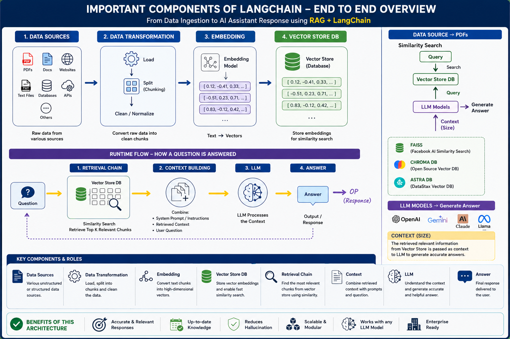

## Important components of Langchain
---

### Data Ingestion:

This is the process of loading data from various sources, often referred to as document loaders. You will learn how to read different types of files and convert them into documents for further processing.

---

### Data Transformation:

After ingestion, the data often needs to be transformed before use. This involves converting text into vectors, which prepares it for processing by language models.

---

### Vector Store:

Once data is transformed, it is stored in a vector store database. This allows for efficient retrieval during the model's operation.
Retrieval Chains:

This involves creating a retrieval chain that leverages the transformed data and prompt templates to interact with the language model effectively. It directly influences how responses are generated.

---

### Prompt Templates:

These templates are essential in guiding the language model by providing a structured format for input, which helps in generating more accurate and relevant outputs.
Output Parsers:

After the model generates a response, output parsers interpret the results and format them appropriately for the intended use.

---

### LangChain Expression Language (LCEL):

This component is used to chain different components together in a logical flow to develop applications efficiently.

---

### Lang Serve:

This is a newer component that focuses on deploying applications created using Langchain, facilitating their use in production environments.
By understanding and implementing these components, you will build a solid foundation for developing applications using

---

